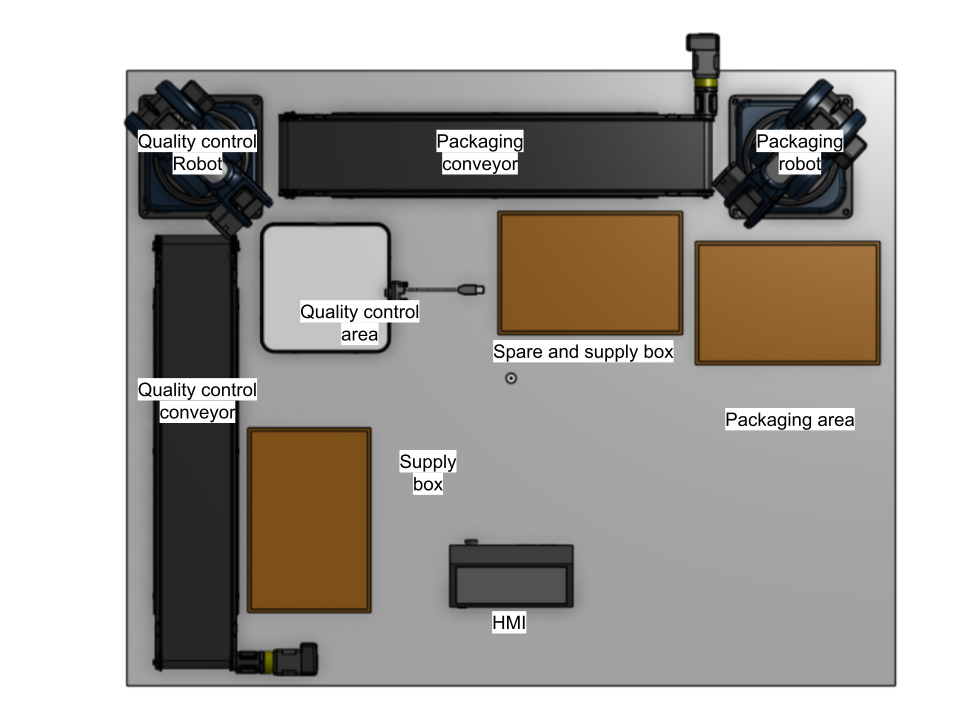

## Introduction

Welcome to the ROSCON FR/DE 2025 "Get Your Hands Dirty" workshop! Thank you for joining us and for your enthusiasm to build, test, and iterate hands-on with ROS 2 and MoveIt 2.

- Date: November 17, 2025
- Location: Strasbourg/Straßburg
- Duration: approximately 4 hours
- Team setup: please form teams of 4 before beginning

Over the next few hours, you and your teammates will explore a ready-to-run robotics stack, integrate motion planning, and iterate on real-world integration tasks. The goal is to learn by doing, share insights, and have fun building together.

Special thanks to the Niryo Core Team : Thomas Deffontaines (Integration Team), Justin Mottier, Thomas Degallaix, Christopher Dedeurwaerder & Pierre Hantson (Software Team)

Let’s get started!

## Hardware setup

Please ensure the following before we begin:

- Participant equipment (you bring):
  - At least two different computers (laptops) for teamwork and multi-machine ROS 2 networking

- Provided by organizers (we bring):
  - 2x Niryo Ned3 Pro robots
  - 2x conveyor belts with IR sensors
  - 1x Raspberry Pi 4 connected to a screen via HDMI
  - 1x Ethernet switch and 3x Ethernet cables

Connectivity checklist:
- Verify each conveyor belt is connected to the Ned3 Pro back panel (tool connector) and that its IR sensor is connected to the conveyor electronics as specified by Niryo. **TODO(Thomas): conveyor electronics ?**


**Setup overview:**


## Software setup

There are two ways to run the workshop environment: locally (if you already have ROS 2 Jazzy on your machine) or using our Docker image (recommended for consistency).

### Using a Devcontainer based on our prebuilded image (recommended)

Make sure you have the Devcontainer extension installed in your VSCode or other IDE. 

Then type Ctrl+Shift+P and select "Reopen in Container" to open the workspace in the container.

The container will be built and the workspace will be opened in the container.

### Troubleshooting

Using the Dockerfile, build locally the image, making sure Docker has access to your host network and Display (e.g., export X11 or use Wayland/XQuartz depending on your OS). 

```bash
docker build -t roscon-2025-workshop .
```
Then run the container in your IDE using the command "Reopen in Container".

### Locally 

Create a new workspace and clone the Ned ROS 2 driver in the source folder:

```bash
mkdir -p ~/niryo_workshop/
cd ~/niryo_workshop/
git clone https://github.com/NiryoRobotics/ned-ros2-driver.git
```

Clone the ROSCON workshop

```bash
git clone https://github.com/NiryoRobotics/roscon-2025.git
```

Install ROS 2 dependencies with rosdep:

```bash
cd ~/niryo_workshop
rosdep install --from-paths src --ignore-src -r -y
```

Create a Python virtual environment and install Python dependencies:

```bash
cd ~/niryo_workshop
python3 -m venv venv --system-site-packages
source venv/bin/activate
pip install -r src/ned-ros2-driver/requirements.txt
```

Add ROS_AUTOMATIC_DISCOVERY_RANGE to your .bashrc file to allow the robots to be discovered by the ROS 2 driver without detecting the whole network. This isolates your workspace from other ROS 2 systems on the network:

```bash
echo "export ROS_AUTOMATIC_DISCOVERY_RANGE=LOCALHOST" >> ~/.bashrc
```

**Important - ROS Domain Configuration**: 
During the workshop, multiple robot cells will be operating on the same network. To communicate with your assigned hardware (robot, Raspberry Pi, etc.) while staying isolated from other teams, you need to configure your ROS Domain ID.

**Each hardware cell has a specific ROS_DOMAIN_ID** that will be indicated on the robot or Raspberry Pi at your workstation.

Edit your `~/.bashrc` file (located at `~/.bashrc` locally or `/root/.bashrc` in the devcontainer):

```bash
# Change LOCALHOST to SUBNET to discover devices on the local network
export ROS_AUTOMATIC_DISCOVERY_RANGE=SUBNET

# Set the ROS_DOMAIN_ID provided for your hardware/cell
export ROS_DOMAIN_ID=XX  # Replace XX with the domain ID written on your robot/Raspberry Pi
```

**Configuration steps**:
1. **Find your domain ID**: Check the label on your robot or Raspberry Pi for the assigned `ROS_DOMAIN_ID`
2. **Change discovery range**: Set `ROS_AUTOMATIC_DISCOVERY_RANGE=SUBNET` in your `~/.bashrc`
3. **Set your domain ID**: Add `export ROS_DOMAIN_ID=XX` (replace XX with your assigned number)
4. **Apply changes**: Run `source ~/.bashrc` or open a new terminal

**Why this works**: 
- `SUBNET` allows discovery of ROS 2 nodes across the local network (needed to find robots and Raspberry Pi devices)
- `ROS_DOMAIN_ID` provides isolation by ensuring you only communicate with devices in your assigned domain
- This allows multiple teams to work simultaneously without interference

**Note**: If you switch between different parts of the workshop (quality check vs packaging) or move to a different robot cell, remember to update the `ROS_DOMAIN_ID` and source your bashrc again!

### Common steps (Local and Docker)

Set up the ROS 2 driver configuration:

```bash
~/niryo_workshop/ned-ros2-driver/niryo_ned_ros2_driver/config/drivers_list.yaml
```


Add the IP of the Ethernet interface of your robot (written on your table), then save `drivers_list.yaml`.

Build your workspaces and source its setup:

```bash
source /opt/ros/jazzy/setup.bash 
cd ~/niryo_workshop
colcon build
source install/setup.bash
```

Tip: add the `source` lines to your `~/.bashrc` so you don’t have to source them in every new terminal.

Run the ros2 driver to enable communication with the robots : 
```bash
ros2 launch niryo_ned_ros2_driver driver.launch.py
```

Finally, for each robot you need to initialize the conveyor belt by calling the following service:
```bash
ros2 service call /niryo_robot/conveyor/ping_and_set_conveyor niryo_ned_ros2_interfaces/srv/SetConveyor "{cmd: 1, id: 9}"
```
It has to be called only once, not each time you run the program.

## Context

A pharmaceutical company based in Basel recruited two interns to perform a robotics integration with Niryo Ned3 Pro robots.  
The goal of this integration is to mimic the behavior of an entire factory that sorts chemical products in vials between safe and unsafe categories (classified according to their color) and packs them into boxes to be shipped to pharmacies all over the world. 

In this workshop, you will read their internship report. They will explain how they performed their solution.  
Your first goal will be to follow their path to recreate this solution. We will call it the **"Naive Solution"**, as it works but in an imperfect way.  

Your second goal will be to read the professor's comments on their report. They suggested ways to enhance the performance of the solution in order to meet the requirements expected by the company.  

Finally, as a bonus, feel free to apply the professor's feedback not only to the corresponding part of the solution but also to other parts, and add your own improvements to exceed the company's requirements.

Here are the profiles of both students : 

### Paul-Louis Chardonnay


Education : Final year of Master's degree in Mechatronics Engineering at the University of Lille

Skills : Experience with ROS 2 and MoveIt 2, understands the basics of robotics hardware and automation.

Personality :
- Adept of the "good enough" principle, so that he can meet on time with his friends for the "apéro" at 6pm to the local bar (the only time he is not late)
- Lied on his resume to get the internship, especially about his experience with Moveit 2 (he just know the name of the framework) and his level in german (he just know the word "Hallo", but they pay more there).

He will be in charge of the Packaging line integration, as he has "already" worked with Moveit 2. And as a frenchman, he will be able to communicate with the Niryo integration team if he needs help with the trajectories and the hardware.

Gameplay : Paul-Louis implemented a lazy solution that is not very sophisticated. He just did the bare minimum to pass the internship. Nevertheless, the feedback will be performed by the Niryo Team, it will thus be more guided than a professor would, and it is also more industry oriented. This character is perfect for persons who want to discover how ROS2 tools can be used to perform a real industrial integration, and know more about trajectories and industrial planning.

Click [here](workshop/workshop_packaging_manager/pl_chardonnay_report.md) to read his report.

### Hans-Günther Biermann


Education : Bachelor's degree in Computer Science at the University of Stuttgart

Skills : Comfortable with Python and programming in general, took an optional course in computer vision applied to robotics so he can handle basic ROS 2 tasks.

Personality :
- Drinks a beer for breakfast at 6.30am every day to enhance his concentration and work all day long without stopping.
- Always thinks about performance and efficiency, overthinking is the best quality to be a good engineer in his opinion.

He will be in charge of the Quality Check line integration, as he has strong background in computer vision.

Gameplay : Hans-Günther implemented a solution that is over-engineered for the task, leading to an unefficient solution with a complex architecture. The feedback will be performed by a university professor that does not have engough time to provide a guided feedback leading to a perfect solution. This character is perfect for persons who want to learn how to design and lead a complex integration project, based on ROS2 and that uses principles of good Python programming, such as encapsulation, multi-threading... It also talks about AI integration in an industrial context.

Click [here](workshop/workshop_quality_check_manager/hg_biermann_report.md) to read his report.

## Next Step

For the following parts of the workshop, we will divide your team in two groups : Those who will read and follow the work of Paul-Louis, and the others who will read and follow the work of Hans-Günther. 

To start the reproducing the Naive solution, please start from the packages located inside the `workshop` folder.

Each markdown file contains the instructions to reproduce the Naive solution on Hans-Günther's or Paul-Louis's line.
