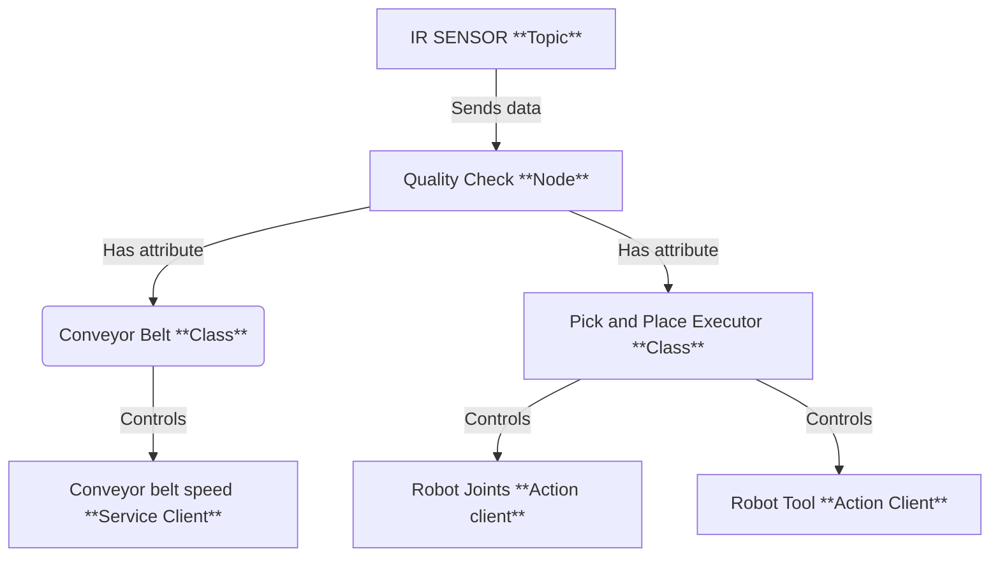
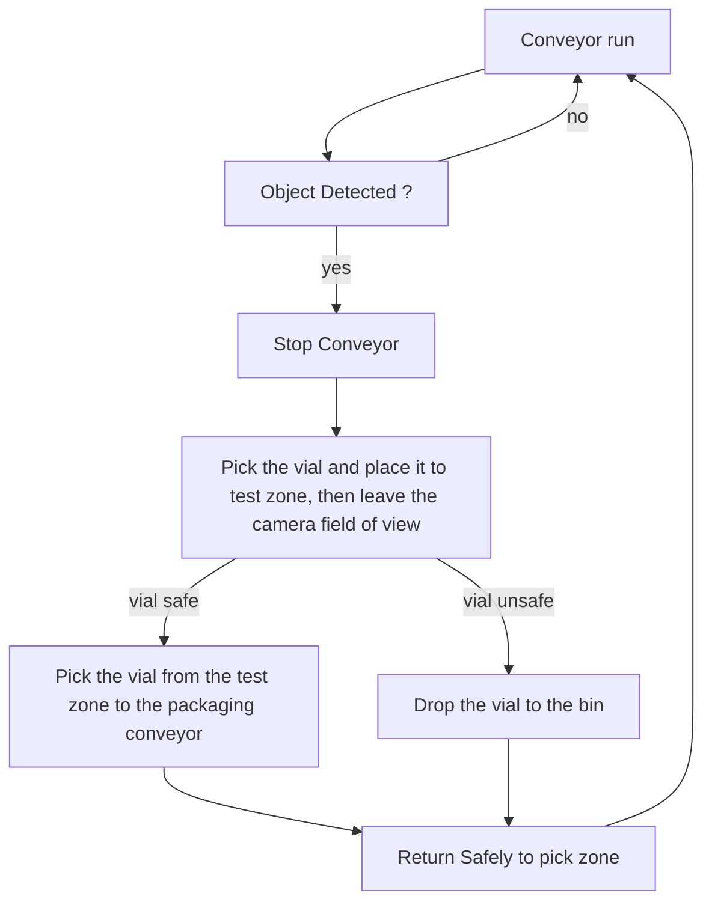
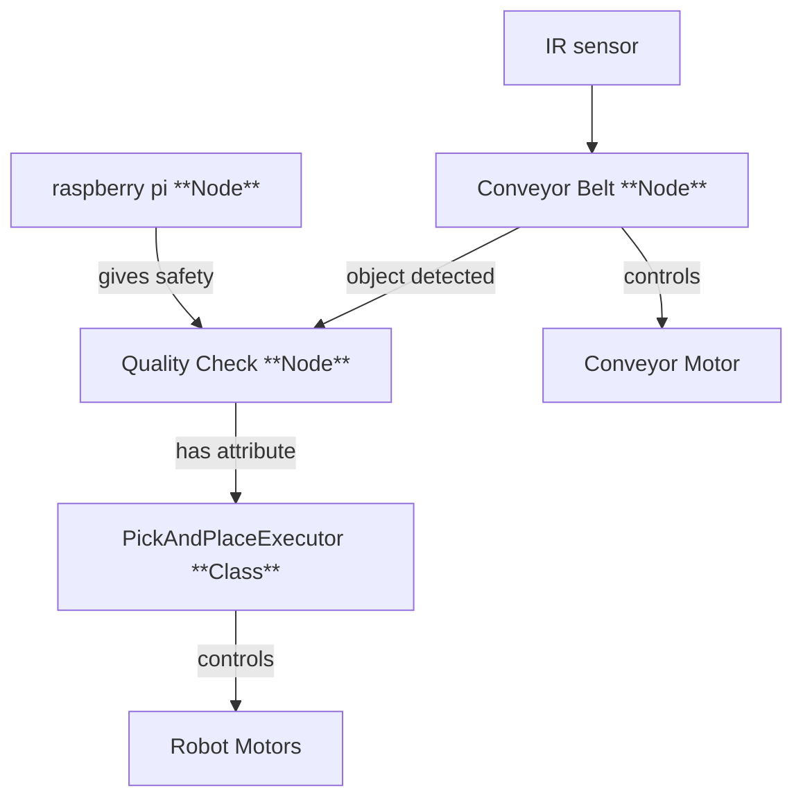

# Hans-Günther Biermann's Report

## Introduction
During my internship in Basel, I was tasked with integrating a Niryo Ned3 Pro robot into a quality check line. The main goal was to sort chemical products in vials between safe and unsafe categories (classified according to their color) and place the safe ones in a packaging line, which will be created by a french fellow that worked with me on the global project.

The robot was equipped with a conveyor belt with an IR sensor to detect the presence of a vial. The robot was also equipped with a  customized gripper to pick and place the vials. To check the safety of each vial, we created a testing zone composed by a standard camera and a plate. The camera is pluged to a Raspberry Pi where the safety testing is proceed. The camera view is displayed to a screen with some logs via an HDMI cable. 

To perform that I will propose two ROS2 packages, that will handle both robot's and raspberry's tasks. 
    
## My Solution

### Robot side
On the robot side we provide a ROS2 package that handles the robot's task, starting with a pick and place action when an object is detected by the IR sensor, from the conveyor belt to the testing zone. Once the safety state of the vial is recieved fom the raspberry, the robot will move to the packaging line to place the vial if it's safe, or to the reject zone if it's unsafe.

For the realization of this pakcage I propose the following architecture :


**For the following steps, please refer to the code in the `src/workshop/workshop_quality_check_manager/scripts/quality_check_node.py` file.**

Starting with the main Class, the `Quality Check Node`. 

It starts with the initialization of the parameters : 

```python
# --- Parameters ---
        self.conveyor_id = self.declare_parameter("conveyor_id", 9).get_parameter_value().integer_value
        self.speed = self.declare_parameter("speed", 60).get_parameter_value().integer_value
        self.sensor_index = self.declare_parameter("sensor_index", 4).get_parameter_value().integer_value
        self.digital_state_topic = self.declare_parameter(
            "digital_state_topic", "/niryo_robot_rpi/digital_io_state"
        ).get_parameter_value().string_value
        self.conveyor_service = self.declare_parameter(
            "conveyor_service", "/niryo_robot/conveyor/control_conveyor"
        ).get_parameter_value().string_value
        self.robot_action = self.declare_parameter(
            "robot_action", "/niryo_robot_arm_commander/robot_action"
        ).get_parameter_value().string_value
        self.tool_action = self.declare_parameter(
            "tool_action", "/niryo_robot_tools_commander/action_server"
        ).get_parameter_value().string_value
        self.tool_id = self.declare_parameter("tool_id", 11).get_parameter_value().integer_value
        self.max_torque_percentage = self.declare_parameter("max_torque_percentage", 100).get_parameter_value().integer_value
        self.hold_torque_percentage = self.declare_parameter("hold_torque_percentage", 100).get_parameter_value().integer_value
```

The niryo conveyor belt has an ID of 9 by default. The id is nevertheless set as a parameter to be able to use another conveyor belt if needed in a future implementation. 

The speed parameter describes the percentage of the conveyor belt max speed. I decided to set it by 60% by default because after some tests, I found that higher speeds were not stable enough for the robot to pick and place the vials.

The `sensor_index` parameter is used to get the index of the digital input that is used to detect the presence of a vial. I decided to set it to 4 by default because the IR sensor is the fourth digital input of the robot by default. Neverthless, it is set as a parameter to be able to use another sensor if needed in a future implementation.

The topic, services and actions names are also set as parameters in order to be able to change it if the niryo's API changes in the future. The default values are the ones used in the Niryo Ned3 Pro robot as today. 

The `tool_id` is set as a parameter as it is different for every Gripper and Tool of the Niryo Brand. For this application we modified a **Custom Gripper** to be able to pick the vials. The default value is thus the one of the Custom Gripper (11).

Finally, the max_torque_percentage and hold_torque_percentage parameters are by default set to 100% because maximum force is needed for the vials to be grabbed. They are set as parameters to be able to re-use the code for other applications in the factory.

Then, the node loads the poses from the `poses.yaml` file.

```python
# --- Poses ---
default_poses_path = os.path.join(
    get_package_share_directory("ned3pro_quality_check_manager"), "config", "poses.yaml"
)
poses_path = self.declare_parameter("poses_path", default_poses_path).get_parameter_value().string_value
with open(poses_path, "r") as f:
    poses_file = yaml.safe_load(f)
poses = poses_file.get("poses", {})
```

The poses are loaded from the `poses.yaml` file. The file is located in the `config` folder of the `workshop_quality_check_manager` package. The file contains the poses for the robot to move to. They are configured into a .yaml file to be able to easily modify them if needed, as each robot can slightly differ from the other.

As described in the schema, the node creates a `Conveyor Controller` and a `Pick and Place Executor`. It distributes the corresponding parameters to the two classes.

```python
# --- Helpers ---
self.conveyor = ConveyorController(self, self.conveyor_service, self.conveyor_id, self.speed)
tool_cfg = {"id": self.tool_id, "max": self.max_torque_percentage, "hold": self.hold_torque_percentage}
self.pick_place = PickAndPlaceExecutor(self, self.robot_action, self.tool_action, poses, tool_cfg)
```
We finally subscribe to the digital state topic and the safety state topic, as well as creating 2 variables to store the last object detected and the last safety state recieved from the raspberry.

```python
# --- State ---
self._last_object_detected = None
self._last_safety_state: str | None = None

# --- Subscription ---
qos = QoSProfile(
    reliability=ReliabilityPolicy.RELIABLE,
    history=HistoryPolicy.KEEP_LAST,
    depth=10,
)
self.create_subscription(DigitalIOState, self.digital_state_topic, self._on_digital_state, qos)
self.create_subscription(String, "/safety_state", self._on_safety_state, 10)
```
We also introduce a QoS Profile to ensure that the messages from the IR sensor are never lost if a new object is detected. We chose the RELIABLE policy to prevent any loss of data and ensure maximum safety. We also keep the last 10 messages in memory to avoid any loss of data and use the last messages to be stored to be up to date at each time. Remember : always put safety first !

**For now, you will note that the methods of your classes are empty. From the instructions given by Hans-Günther, complete the missing methods to be able to reproduce the naive solution.**

Both subscriptions lead to the executions of the respectives methods `_on_digital_state` and `_on_safety_state`.

The IR sensor returns a boolean value, stored in the 5th index of the digital inputs table. This table is a list of boolean values, each representing the state of a digital input and published each time there is a change of at least one digital input. I decided to define the subscription to the `digital_state_topic` here as the IR sensor is plugged to the robot and not to the conveyor belt in real life. 

The table is published on the `digital_state_topic` and the message is a `DigitalIOState` message type.

The value is 1 when no object is detected, and 0 when an object is detected. Meaning we should invert it before placing it in the variable `_last_object_detected`.

The safety state is a string value. It is published on the `safety_state` topic and the message data can be directly stored in the variable `_last_safety_state`.

For these two methods, we consider implementing a simple error handling to avoid any crash of the node, especially for the `digital_state` topic, as the index can be an invalid parameter (i.e not in the list).


The `ConveyorController` class is responsible for controlling the conveyor belt. It is initialized with the parameters passed to the node and creates a service client to control the conveyor belt : 

```python
    def __init__(self, node: Node, service_name: str, conveyor_id: int, speed: int) -> None:
        self._node = node
        self._client = node.create_client(ControlConveyor, service_name)
        self._conveyor_id = conveyor_id
        self._speed = speed
        self._current_state = None

        if not self._client.wait_for_service(timeout_sec=5.0):
            self._node.get_logger().error(f"Service {service_name} not available !")

```

The only method to implement in this class is the `set_running` method, that is used to control the speed of the conveyor belt. 

To set the speed of the conveyor belt, we create a request to the service client and set the speed to the desired value along with the direction of the conveyor belt.

Here is the request type to control the conveyor belt :
```python
uint8 id
bool control_on
int16 speed
int8 direction
```
`control_on` should be set to True to activate the conveyor belt. 
`direction` is set to 1 for the conveyor belt running in the direction of the robot, 0 to be stopped and -1 to be running in the opposite direction.

This method should also update the `current_state` variable to the new state of the conveyor belt.

To send the request we use the `call_async` method of the service client.
```python
future = self._client.call_async(req)
rclpy.spin_until_future_complete(self._node, future)
```
The `PickAndPlaceExecutor` class is responsible for controlling the robot's task. It is initialized with the parameters passed to the node and creates two action clients to control the robot's and tool's movements.

```python
    def __init__(self, node: Node, robot_action: str, tool_action: str, poses: dict, tool_cfg: dict) -> None:
        self._node = node
        self._robot = ActionClient(node, RobotMove, robot_action)
        self._tool = ActionClient(node, Tool, tool_action)
        self._poses = poses
        self._tool_cfg = tool_cfg
```

In this class, I implemented 2 methods, each responsible for the control of the robot's and tool's movements. They are called `_move` and `_tool_cmd` and send a goal to the respectives action servers.

Here is the goal type to control the robot's movements :

```python
int32 JOINTS = 0            # uses joints 
int32 POSE = 1              # uses position and rpy 
int32 POSITION = 2          # uses position
int32 RPY = 3               # uses rpy
int32 POSE_QUAT = 4         # uses position and orientation
int32 LINEAR_POSE = 5       # uses position and rpy
int32 SHIFT_POSE = 6        # uses shift
int32 SHIFT_LINEAR_POSE = 7 # uses shift
int32 EXECUTE_TRAJ = 8      # uses dist_smoothing, list_poses
int32 DRAW_SPIRAL = 9
int32 DRAW_CIRCLE = 10
int32 EXECUTE_FULL_TRAJ = 11
int32 EXECUTE_RAW_TRAJ = 12

int32 cmd_type

int32 LEGACY = 1
int32 DH_CONVENTION = 2
int32 tcp_version

float64[] joints
geometry_msgs/Point position
niryo_robot_msgs/RPY rpy
geometry_msgs/Quaternion orientation
niryo_robot_arm_commander/ShiftPose shift

geometry_msgs/Pose[] list_poses
float32 dist_smoothing

trajectory_msgs/JointTrajectory trajectory

float64[] args

```
We here only want to move the robot using joint positions, the cmd_type is set to 0. 

For the tool, we use the Tool action server to control the tool's movements : 

```python
# Gripper
int8 OPEN_GRIPPER = 1
int8 CLOSE_GRIPPER = 2


uint8 cmd_type


int8 tool_id


uint8 max_torque_percentage
uint8 hold_torque_percentage


```
To set a goal to an action we use the `send_goal_async` method of the action client.

```python
        send_future = self._tool.send_goal_async(goal)
        rclpy.spin_until_future_complete(self._node, send_future)
        goal_handle = send_future.result()
        if not goal_handle.accepted:
            self._node.get_logger().error("command rejected")
            return
        result_future = goal_handle.get_result_async()
        rclpy.spin_until_future_complete(self._node, result_future)

```

With this base, we have everything to perform our application. I will now describe the path I followed to implement my solution. 

In my head, I like to have everything clear, separated and easy to understand. I thus, divided the work into bricks that make a chain of actions. Here is the diagram that explain the path of resolution for the application. 


The `run_loop` method is the one called by the main function, every time it is called we make the node spin once, in order to execute all the actions previously stated. 

We begin by verifying if an object has been detected by the IR sensor, in this case we sant to ensure that the conveyor is running. We then ant to return to the begining of the loop to wait for the next object, this can be perform in python by using a `continue` statement.

If an object is detected, we call our `set_running` method from the conveyor controller to stop the conveyor belt. 

Now here comes the fun part. We need to perform the pick and place operation. As previously stated, I decided to split the operation into two phases. The first pick and place the vial to the test zone, then leave the camera field of view. And the second phase is to pick the vial from the test zone to the packaging conveyor, or to the bin if it's unsafe and then return safely to the pick zone.

I am a very precautionnary person, so I used all my mind to engineer the safest path for the robot to perform this operation. A good thing to know with Niryo robots is that you can use the `freemotion` button, located on the robot's forearm, to move the robot's hand freely. This is very useful to take positions in real life and reproduce them in the code. I stored all these position as joint states in the `poses.yaml` file. To record the positions I listened to the `joint_states` topic..

For the first phase, I took 4 positions to perform the pick and place. The first one is the `grip` position where the robot hand is opened and ready to recieve a vial. Then I want the robot to close the gripper and slowly move in a vertical line to raise the vial to an upper position called `high1`. Then, the robot turns to its left to the `high2` position making a circle trajectory until the vial is just above the test zone. And then we perform a vertical straight line to the `low1` position where the robot opens the gripper and slowly moves back to the `high2` position to safely leave the camera field of view.

When the safety response is recieved, we go back to the `low1` position, grab the vial and move to the `safe` or `unsafe` position depending on the safety state passing by the `high2` position to ensure maximum safety. 

When the second pick and place is performed, we return to the `grip` position to wait for the next object, obvioulsy passing back by the `high2` and `high1` positions to ensure maximum safety, as we want the robot to arrive in a straight line to the conveyor belt before setting it back to run and reseting the `last_object_detected` variable because **safety first**, we never know !

**For now, follow the instructions given by Hans-Günther to complete the missing run loop. Fill the poses.yaml file with the positions you took. You can create some methods on the pick and place executor to perform the two phases and make the code more readable.**

**The correction for the Naive solution is in the `src/ned3pro_quality_check_manager/scripts/quality_check_node_naive.py` file.**


### Raspberry side

### Nota Bene
To make the conveyor runs, you need to initialize it by calling a niryo service. You just have to call it once, not each time you run the program. 

```bash
ros2 service call /niryo_robot/conveyor/ping_and_set_conveyor niryo_ned_ros2_interfaces/srv/SetConveyor "{cmd: 1, id: 9}"
```

## Professor's Feedback

Satisfactory overall job (3.5) !

Even if the code is not perfect and the requests of the client are not fully fullfiled, the code is working and the robot is performing the task safely concerning the trajectory part, even if quite slowly.

Nevertheless, the quality check logic is incorrect, containing errors that can lead to unsafe vials being placed in the packaging line.

Here are some feedbacks to improve the code : 

### Quality Check Logic

The main problem of your implementation concerns the logic of the quality check. Firstly because the parameters you applied to the camera are not correct and leads the model to have a bad interpretation of the safety state. Indeed the image you checked on the screen was not the one the modifications were applied to. Please review this image and apply the correct parameters to the camera refering to the images the AI model was trained with. Optimizing the image to speed up the inference time a good idea thought.

Secondly, you decided to publish the safety state on a topic every 5 seconds. Because that's the median time to perform a trajectory in your operation. This is not a good idea because what if the image is not taken at the right time ? Imagine a case where the image is taken without a vial, the last safety state would be randomly chosen.

To solve that we recommand to use a service to get the safety state. This service should be called each time the robot is in the test zone and the safety state should be returned.

### Code Quality

The client requests are not fully fullfiled in term of performances. We, professors judge that the whole architecture of the project is not optimized. The conveyor belt belonging to the robot leads to the impossibility for it to run while the robot is performing the operation. 

A way to solve the problem would be to consider the robot and the conveyor belt as two different entities, each one being its own node. 

Here is a scheme of the suggested architecture :


Both The conveyor belt are now independently controlled with this architecture, each one being its own node. Note that the IR sensor is now owned by the conveyor belt class as the IR sensor is located on the conveyor belt, even if plugged to the robot, as its message only sends data used to control the conveyor belt.

In ROS2, there is a way to ensure that both nodes are launched in parallell, using multithreading. Each node being executed in a seperate thread, we can ensure that no blocking action will stop the other node from working.

To perform this, we can use ROS2 Executors, and especially the `MultiThreadedExecutor`, that runs each node in a seperate thread.

Example : 

```python
#!/usr/bin/env python3

import rclpy
from rclpy.node import Node
from rclpy.executors import MultiThreadedExecutor
import time


class Node1(Node):
    def __init__(self):
        super().__init__("node1")
        self.timer1 = self.create_timer(1.0, self.callback_timer1)

    def callback_timer1(self):
        time.sleep(2.0)
        self.get_logger().info("cb 1")


class Node2(Node):
    def __init__(self):
        super().__init__("node2")
        self.timer2 = self.create_timer(1.0, self.callback_timer2)

    def callback_timer2(self):
        time.sleep(2.0)
        self.get_logger().info("cb 2")


def main(args=None):
    rclpy.init(args=args)

    node1 = Node1()
    node2 = Node2()

    executor = MultiThreadedExecutor()
    executor.add_node(node1)
    executor.add_node(node2)

    try:
        executor.spin()
    finally:
        executor.shutdown()
        node1.destroy_node()
        node2.destroy_node()
        rclpy.shutdown()


if __name__ == "__main__":
    main()
```

These two basic nodes are now able to run in parallel, each one in its own thread.

Another important concept about MultiThreadedExecutor is that by default the callbacks are executed sperately and wait for each other. This is because a default callback is a Mutually Exclusive Callback Group, meaning that only one callback can be executed at a time.  Declaring a `ReentrantCallbackGroup` will allow the callbacks to be executed in parallel. In a Reentrant Callback Group, the callbacks are executed each time the timer call them, meaning they are not waiting for any other callback to be executed. Please consider building your new architecture with this concept in mind.

Note that the main challenge of transforming your code to this new architecture will be to avoid **deadlocks**. Deadlocks are a situation where two or more threads are waiting for each other to release a resource, causing a deadlock. It is very common to have deadlocks in a multi-threaded architecture, especially when creating action clients and service clients. 

In the previous code, you used the `rclpy.spin_until_future_complete` function to wait for the future to be completed. This function is not thread-safe and will cause a deadlock. Indeed, the executor is already spinning, and calling this function will cause the executor to spin again, waiting for an answer that should come in this exact same thread, that is block waiting for itself. What a tricky situation !

One strategy to avoid this is to use the `add_done_callback` method of the future, to add a callback that will be executed when the future is completed. This callback should not be executed in the same thread as the one calling the `add_done_callback` method, avoiding the deadlock, freeing the thread from the waiting loop.

Example : 
```python
future = self._robot.send_goal_async(goal)
#rclpy.spin_until_future_complete(self._node, future) will cause a deadlock
future.add_done_callback(lambda fut: self._on_result_response(fut))

def _on_result_response(self, future):
    result = future.result()
    self._node.get_logger().info("Entered the callback")
```


Note that the callbacks should communicate their state to the main thread, using a shared variable to prevent the execution of multiple actions at the same time, now that the response is recieved in a different thread.


## Bonus

Hey ! Pierre's talking, I just infiltrated Hans-Günther's report ! I just wanted you to know that the other part of your team read Paul-Louis's report and got completely different feedbacks ! One told me that they still don't have MultiThreading, meaning that their conveyor is not working as fine as yours... Would you mind checking if you can implement this feature in their code ? I think it would be a great improvement for the project !


