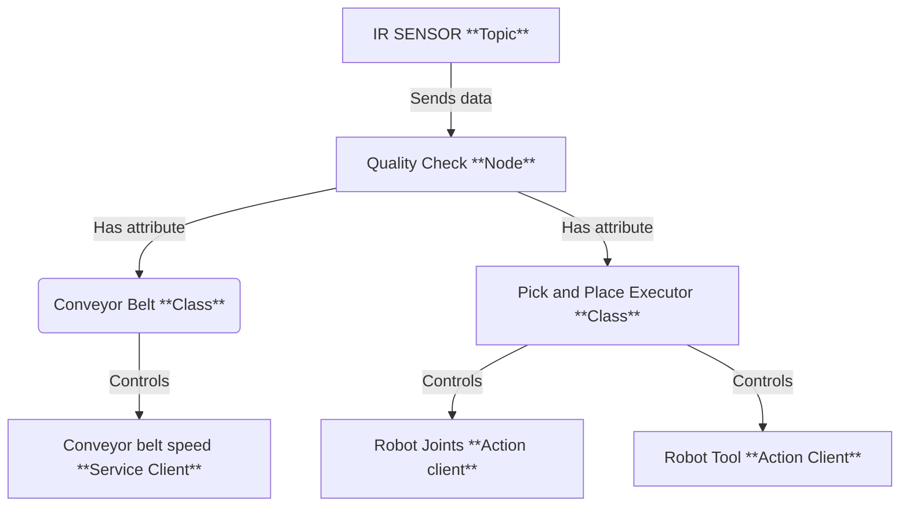

# Hans-Günther Biermann's Report

## Introduction
During my internship in Basel, I was tasked with integrating a Niryo Ned3 Pro robot into a quality check line. The main goal was to sort chemical products in vials between safe and unsafe categories (classified according to their color) and place the safe ones in a packaging line, which will be created by a french fellow that worked with me on the global project.

The robot was equipped with a conveyor belt with an IR sensor to detect the presence of a vial. The robot was also equipped with a  customized gripper to pick and place the vials. To check the safety of each vial, we created a testing zone composed by a standard camera and a plate. The camera is pluged to a Raspberry Pi where the safety testing is proceed. The camera view is displayed to a screen with some logs via an HDMI cable. 

To perform that I will propose two ROS2 packages, that will handle both robot's and raspberry's tasks. 
    
## My Solution

### Robot side
On the robot side we provide a ROS2 package that handles the robot's task, starting with a pick and place action when an object is detected by the IR sensor, from the conveyor belt to the testing zone. Once the safety state of the vial is recieved fom the raspberry, the robot will move to the packaging line to place the vial if it's safe, or to the reject zone if it's unsafe.

For the realization of this pakcage I propose the following architecture :


**For the following steps, please refer to the code in the `src/workshop/workshop_quality_check_manager/scripts/quality_check_node.py` file.**

Starting with the main Class, the Quality Check Node. 

It starts with the initialization of the parameters : 

```python
# --- Parameters ---
        self.conveyor_id = self.declare_parameter("conveyor_id", 9).get_parameter_value().integer_value
        self.speed = self.declare_parameter("speed", 60).get_parameter_value().integer_value
        self.sensor_index = self.declare_parameter("sensor_index", 4).get_parameter_value().integer_value
        self.digital_state_topic = self.declare_parameter(
            "digital_state_topic", "/niryo_robot_rpi/digital_io_state"
        ).get_parameter_value().string_value
        self.conveyor_service = self.declare_parameter(
            "conveyor_service", "/niryo_robot/conveyor/control_conveyor"
        ).get_parameter_value().string_value
        self.robot_action = self.declare_parameter(
            "robot_action", "/niryo_robot_arm_commander/robot_action"
        ).get_parameter_value().string_value
        self.tool_action = self.declare_parameter(
            "tool_action", "/niryo_robot_tools_commander/action_server"
        ).get_parameter_value().string_value
        self.tool_id = self.declare_parameter("tool_id", 11).get_parameter_value().integer_value
        self.max_torque_percentage = self.declare_parameter("max_torque_percentage", 100).get_parameter_value().integer_value
        self.hold_torque_percentage = self.declare_parameter("hold_torque_percentage", 100).get_parameter_value().integer_value
```

The niryo conveyor belt has an ID of 9 by default. The id is nevertheless set as a parameter to be able to use another conveyor belt if needed in a future implementation. 

The speed parameter describes the percentage of the conveyor belt max speed. I decided to set it by 60% by default because after some tests, I found that higher speeds were not stable enough for the robot to pick and place the vials.

The sensor_index parameter is used to get the index of the digital input that is used to detect the presence of a vial. I decided to set it to 4 by default because the IR sensor is the fourth digital input of the robot by default. Neverthless, it is set as a parameter to be able to use another sensor if needed in a future implementation.

The topic, services and actions names are also set as parameters in order to be able to change it if the niryo's API changes in the future. The default values are the ones used in the Niryo Ned3 Pro robot as today. 

The tool_id is set as a parameter as it is different for every Gripper and Tool of the Niryo Brand. For this application we modified a **Custom Gripper** to be able to pick the vials. The default value is thus the one of the Custom Gripper (11).

Finally, the max_torque_percentage and hold_torque_percentage parameters are by default set to 100% because maximum force is needed for the vials to be grabbed. They are set as parameters to be able to re-use the code for other applications in the factory.

Then, the node loads the poses from the `poses.yaml` file.

```python
# --- Poses ---
default_poses_path = os.path.join(
    get_package_share_directory("ned3pro_quality_check_manager"), "config", "poses.yaml"
)
poses_path = self.declare_parameter("poses_path", default_poses_path).get_parameter_value().string_value
with open(poses_path, "r") as f:
    poses_file = yaml.safe_load(f)
poses = poses_file.get("poses", {})
```

The poses are loaded from the `poses.yaml` file. The file is located in the `config` folder of the `workshop_quality_check_manager` package. The file contains the poses for the robot to move to. They are configured into a .yaml file to be able to easily modify them if needed, as each robot can slightly differ from the other.

As described in the schema, the node creates a Conveyor Controller and a Pick and Place Executor. It distributes the corresponding parameters to the two classes.

```python
# --- Helpers ---
self.conveyor = ConveyorController(self, self.conveyor_service, self.conveyor_id, self.speed)
tool_cfg = {"id": self.tool_id, "max": self.max_torque_percentage, "hold": self.hold_torque_percentage}
self.pick_place = PickAndPlaceExecutor(self, self.robot_action, self.tool_action, poses, tool_cfg)
```
We finally subscribe to the digital state topic and the safety state topic, as well as creating 2 variables to store the last object detected and the last safety state recieved from the raspberry.

```python
# --- State ---
self._last_object_detected = None
self._last_safety_state: str | None = None

# --- Subscription ---
qos = QoSProfile(
    reliability=ReliabilityPolicy.RELIABLE,
    history=HistoryPolicy.KEEP_LAST,
    depth=10,
)
self.create_subscription(DigitalIOState, self.digital_state_topic, self._on_digital_state, qos)
self.create_subscription(String, "/safety_state", self._on_safety_state, 10)
```
We also introduce a QoS Profile to ensure that the messages from the IR sensor are never lost if a new object is detected. We chose the RELIABLE policy to prevent any loss of data and ensure maximum safety. We also keep the last 10 messages in memory to avoid any loss of data and use the last messages to be stored to be up to date at each time. 

**For now, you will note that the methods of your classes are empty. From the instructions given by Hans-Günther, complete the missing methods to be able to reproduce the naive solution.**

Both subscriptions lead to the executions of the respectives methods _on_digital_state and _on_safety_state.


### Raspberry side


## Professor's Feedback

## Bonus

## Conclusion
