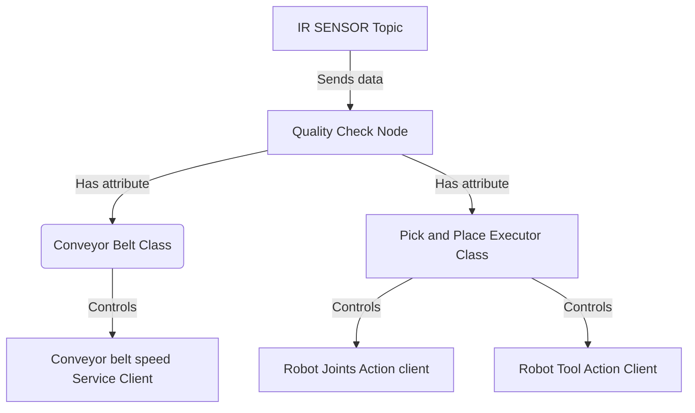

# Hans-Günther Biermann's Report

## Introduction
During my internship in Basel, I was tasked with integrating a Niryo Ned3 Pro robot into a quality check line. The main goal was to sort chemical products in vials between safe and unsafe categories (classified according to their color) and place the safe ones in a packaging line, which will be created by a french fellow that worked with me on the global project.

The robot was equipped with a conveyor belt with an IR sensor to detect the presence of a vial. The robot was also equipped with a  customized gripper to pick and place the vials. To check the safety of each vial, we created a testing zone composed by a standard camera and a plate. The camera is pluged to a Raspberry Pi where the safety testing is proceed. The camera view is displayed to a screen with some logs via an HDMI cable. 

To perform that I will propose two ROS2 packages, that will handle both robot's and raspberry's tasks. 
    
## My Solution

### Robot side
On the robot side we provide a ROS2 package that handles the robot's task, starting with a pick and place action when an object is detected by the IR sensor, from the conveyor belt to the testing zone. Once the safety state of the vial is recieved fom the raspberry, the robot will move to the packaging line to place the vial if it's safe, or to the reject zone if it's unsafe.

For the realization of this pakcage I propose the following architecture :

### Raspberry side

## Professor's Feedback

## Bonus

## Conclusion
