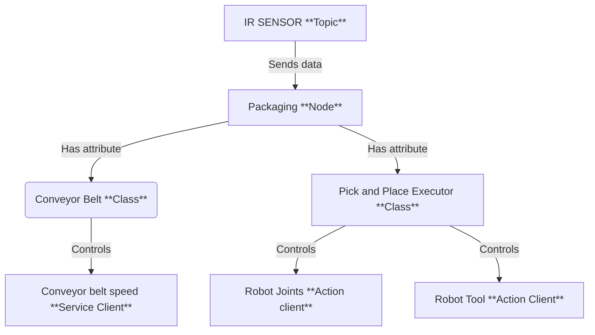

# Paul-Louis Chardonnay's Report

## Introduction
Answering to all job application in Switzerland I saw on LinkedIn during 6 month, I finally encounted a company that was looking for a robot integrator. I applied and was accepted for an internship in Basel, Switzerland. This company sells chemical products to pharmacies all over the world, a stunning industry that I won't miss to add to my resume. During my internship I was asked to integrate a Niryo Ned3 Pro robot into a packaging line in order to pack the chemical products into boxes, finalzing the whole production process whose begining has been automated by my fellow intern Hans-Gunther. My internship is also a partnership with the Niryo company itself, as they will be in charge of sending the hardware and providing feedback to my implementation, before all I wanted to thanks them for this opportunity.

The goal of the integration is simple : a vial is detected by an IR sensor on a conveyor belt, the robot is asked to pick it up and place it in a box in order to be packed and sent to the warehouse. 

To perform that I will propose a ROS2 package that will handle the robot's task. 

## My Solution

### Architecture 
When I arrived at work, approximatly at 11 AM, my german mate who was already there since 7 AM stated that he already thought about an architecture for its side of the solution. One of the thing I learnt in engineering school is that consistency is key, hence, I decided to use the same architecture for my side of the solution. 



**For the following steps, please refer to the code in the `src/workshop/workshop_packaging_manager/scripts/packaging_node.py` file.**

Starting with the main Class, the `Packaging Node`. 

It starts with the initialization of the parameters : 

```python
# --- Parameters ---
        self.conveyor_id = self.declare_parameter("conveyor_id", 9).get_parameter_value().integer_value
        self.speed = self.declare_parameter("speed", 60).get_parameter_value().integer_value
        self.sensor_index = self.declare_parameter("sensor_index", 4).get_parameter_value().integer_value
        self.digital_state_topic = self.declare_parameter(
            "digital_state_topic", "/niryo_robot_rpi/digital_io_state"
        ).get_parameter_value().string_value
        self.conveyor_service = self.declare_parameter(
            "conveyor_service", "/niryo_robot/conveyor/control_conveyor"
        ).get_parameter_value().string_value
```

The niryo conveyor belt has an ID of 9 by default. The id is nevertheless set as a parameter to be able to use another conveyor belt if needed in a future implementation. 

The speed parameter describes the percentage of the conveyor belt max speed. I decided to set it by 60% by default because after some tests, I found that higher speeds were not stable enough for the robot to pick and place the vials.

The `sensor_index` parameter is used to get the index of the digital input that is used to detect the presence of a vial. I decided to set it to 4 by default because the IR sensor is the fourth digital input of the robot by default. Neverthless, it is set as a parameter to be able to use another sensor if needed in a future implementation.

The topic, services and actions names are also set as parameters in order to be able to change it if the niryo's API changes in the future. The default values are the ones used in the Niryo Ned3 Pro robot as today. 

I know that my fellow intern decided to add some other parameters to be able to change joint or girpper parameters in the future, but why the hell would you change joints or girpper type for a fixed application ? That's why I decided to not add them as parameters.

Then, the node loads the poses from the `poses.yaml` file using the `_load_poses` method.

```python
self.poses = self._load_poses()


    def _load_poses(self) -> dict:
        """Load poses from poses.yaml file"""
        try:
            package_share_directory = get_package_share_directory('workshop_packaging_manager')
            poses_file_path = os.path.join(package_share_directory, 'config', 'poses.yaml')
            
            with open(poses_file_path, 'r') as file:
                poses_data = yaml.safe_load(file)
            
            self.get_logger().info(f"Loaded poses: {list(poses_data['poses'].keys())}")
            return poses_data['poses']
            
        except Exception as e:
            self.get_logger().error(f"Failed to load poses.yaml: {e}")
            # Return default poses if file loading fails
            return {
                'home': [0.0, 0.0, 0.0, 0.0, 0.0, 0.0]
            }
```

The poses are loaded from the `poses.yaml` file. The file is located in the `config` folder of the `workshop_packaging_manager` package. The file contains the poses for the robot to move to. They are configured into a .yaml file to be able to easily modify them if needed, as each robot can slightly differ from the other. 

As described in the schema, the node creates a `Conveyor Controller`.

```python
# --- Helpers ---
self.conveyor = ConveyorController(self, self.conveyor_service, self.conveyor_id, self.speed)
```
We finally subscribe to the digital state topic, as well as creating a variable to store the last object detected from the IR sensor.

```python
# --- State ---
self._last_object_detected = None
```
```python
# --- Subscription ---
qos = QoSProfile(
    reliability=ReliabilityPolicy.RELIABLE,
    history=HistoryPolicy.KEEP_LAST,
    depth=10,
)
self.create_subscription(DigitalIOState, self.digital_state_topic, self._on_digital_state, qos)
```

I don't really know what's a QoS Profile to be honest, and I did not dipped into the documentation to find out, I just copied my fellow code that he wrote couple hours before me. It worked so I kept it.

We also initialize the `Pick and Place Executor`, which I modified to use MoveIt2 instead of Niryo's classic python API, but I will explain this later.

```python
# --- Helpers ---
self.pick_place = PickAndPlaceExecutorMoveIt2(self, "arm")
```
**For now, you will note that the methods of your classes are empty. From the instructions given by Paul-Louis, complete the missing methods to be able to reproduce the naive solution.**

The subscription leads to the execution of the `_on_digital_state` method.

The IR sensor returns a boolean value, stored in the 5th index of the digital inputs table. This table is a list of boolean values, each representing the state of a digital input and published each time there is a change of at least one digital input. I decided to define the subscription to the `digital_state_topic` here as the IR sensor is plugged to the robot and not to the conveyor belt in real life. 

The table is published on the `digital_state_topic` and the message is a `DigitalIOState` message type.

The value is 1 when no object is detected, and 0 when an object is detected. Meaning we should invert it before placing it in the variable `_last_object_detected`.

For this method we consider implementing a simple error handling to avoid any crash of the node, especially for the `digital_state` topic, as the index can be an invalid parameter (i.e not in the list).

The `Conveyor Controller` class is responsible for controlling the conveyor belt. It is initialized with the parameters passed to the node and creates a service client to control the conveyor belt : 

```python
    def __init__(self, node: Node, service_name: str, conveyor_id: int, speed: int) -> None:
        self._node = node
        self._client = node.create_client(ControlConveyor, service_name)
        self._conveyor_id = conveyor_id
        self._speed = speed
        self._current_state = None

        if not self._client.wait_for_service(timeout_sec=5.0):
            self._node.get_logger().error(f"Service {service_name} not available !")

```
The only method to implement in this class is the `set_running` method, that is used to control the speed of the conveyor belt. 

To set the speed of the conveyor belt, we create a request to the service client and set the speed to the desired value along with the direction of the conveyor belt.

To create the request, we first create a `ControlConveyor.Request` object.

```python
req = ControlConveyor.Request()
```

Here is the request type to control the conveyor belt :
```python
uint8 id
bool control_on
int16 speed
int8 direction
```

`control_on` should be set to True to activate the conveyor belt. 
`direction` is set to 1 for the conveyor belt running in the direction of the robot, 0 to be stopped and -1 to be running in the opposite direction.

This method should also update the `current_state` variable to the new state of the conveyor belt.

To send the request we use the `call_async` method of the service client.
```python
future = self._client.call_async(req)
rclpy.spin_until_future_complete(self._node, future)
```

### Hans-Günther's Pick and Place Executor
Following the hans-gunther's instructions, I decided to use the same implementation as him, as I wanted to be consistent with his work while I knew i would have to rework this class. 

The pick and place executor is responsible for controlling the robot's task.

```python
    def __init__(self, node: Node, group_name: str = "arm") -> None:
        self._node = node
        
        # Initialize gripper action client (align with quality check node)
        self._tool_action = ActionClient(node, Tool, "/niryo_robot_tools_commander/action_server")
        self._tool_cfg = {
            "id": 11,  # Gripper tool ID
            "max": 100,  # Max torque percentage
            "hold": 100  # Hold torque percentage (align with working node)
        }
        if not self._tool_action.wait_for_server(timeout_sec=5.0):
            self._logger.error("tool server /niryo_robot_tools_commander/action_server not available !")

```

As I wanted to be consistent with his work while using other framework to control the robot, I only pasted his work concerning the gripper action client. We thus declare here the configuration for the Tool. As said before, I prefered to use fix configurations for the tool as we will only use Niryo's components. 

The only method I kept from his implementation is the `_tool_cmd` method, which is used to send a goal to the tool action server. 

```python
# Gripper
int8 OPEN_GRIPPER = 1
int8 CLOSE_GRIPPER = 2


uint8 cmd_type


int8 tool_id


uint8 max_torque_percentage
uint8 hold_torque_percentage


```
To set a goal to an action we use the `send_goal_async` method of the action client.

```python
        send_future = self._tool.send_goal_async(goal)
        rclpy.spin_until_future_complete(self._node, send_future)
        goal_handle = send_future.result()
        if not goal_handle.accepted:
            self._node.get_logger().error("command rejected")
            return
        result_future = goal_handle.get_result_async()
        rclpy.spin_until_future_complete(self._node, result_future)

```

With this base, we have everything to perform our application. I will now describe the path I followed to implement my solution. 

Note that this could be a good idea to create `_open_gripper` and `_close_gripper` methods to make the code more readable.


### My MoveIt2 implementation

When I asked Niryo to give me tips about the integration of a robot, they told me about the ROS2 package named `moveit2`, that could help me with motion planning in order to organise the placement of the vials in the box. Before my internship, I had never heard about it, but I decided to put it as a previous experience on my resume, and I think it was a good choice, as I instantly got the job. 

Anyways, once I arrived here, I had to figure out how this framework worked so that no one would know that I didn't know how to use it. My first move was then to check the documentation and copy-paste the code from the official examples, which worked perfectly. I then asked chat-gpt to explain me each method I "implemented".

Starting with the initialization of the MoveIt2 class, we create a MoveItPy instance, which is the main class of the moveit2 framework.

```python 
self._group_name = group_name
self._logger = get_logger("moveit_py.packaging")

try:
    self._moveit = MoveItPy(node_name="moveit_py_packaging")
    self._arm = self._moveit.get_planning_component(group_name)
    self._planning_scene_monitor = self._moveit.get_planning_scene_monitor()

    self._logger.info("MoveItPy instance created for packaging")

except Exception as e:
    self._logger.error(f"Failed to initialize MoveIt2: {e}")
    raise

```

The `group_name` is the name of the group of joints that we want to control. In our case, it is the `arm` group by default for a niryo robot.

We then create a node for the moveit2 framework. We construct a kinematics arm from the group of joints and we initialize a `planning_scene_monitor` to be able to add collision objects to the planning scene and visualize our robot in the 3D space.

The first helper method implemented is the `plan_and_execute` method. 

```python
def plan_and_execute(
        self,
        single_plan_parameters=None,
        multi_plan_parameters=None,
        sleep_time=0.0,
    ):
        # plan to goal
        self._logger.info("Planning trajectory")
        if multi_plan_parameters is not None:
            plan_result = self._arm.plan(
                multi_plan_parameters=multi_plan_parameters
            )
        elif single_plan_parameters is not None:
            plan_result = self._arm.plan(
                single_plan_parameters=single_plan_parameters
            )
        else:
            plan_result = self._arm.plan()

        # execute the plan
        if plan_result:
            self._logger.info("Executing plan")
            robot_trajectory = plan_result.trajectory
            self._moveit.execute(robot_trajectory, controllers=[])
            time.sleep(sleep_time)
            return True
        else:
            self._logger.error("Planning failed")
            return False

```
This might be the most important method of the class, as it is the most low-level one. It is used to plan and execute a motion, taking in arguments the planner to be used and the sleep time between the planning and the execution. 

It uses the Moveit API to directy execute the trajectory. 

The `compose_pose_stamped` method is used to compose a standard pose stamped message from a pose input. It is just an helper method to avoid code duplication when working with poses instead of joint values.

Both `use_single_pipeline_planning` and `use_multi_pipeline_planning` methods are used to plan and execute a motion, taking in arguments the planner to be used and the sleep time between the planning and the execution. They manage all the process of planning and execution of a motion to a given goal, in pose or joint values. They have the role of high-level methods to plan and execute a motion as they should be the one used in user code. The main difference between both methods is that the `use_single_pipeline_planning` method will only try to plan a trajectory using one planner, while the `use_multi_pipeline_planning` method will try to plan a trajectory using all the planners available and return the first trajectory that is found.

Methods `add_collision_object`, `remove_collision_object` and `remove_all_collision_objects` are used to add, remove and remove all non moving objects from the planning scene (i.e everything but the robot). They are used to simulate obstacles in the planning scene, that will be used to avoid collisions with the robot.

Finally the `check_collision` method is used to check if the robot is in collision with any object in the planning scene. It can be useful for debugging purposes, ensuring no object prevents the robot from reaching its goal.

On the documentation I read, they said that we had to write a configuration for moveit to work properly. I thus copy-pasted the demo file without reading it on the `config/moveit_py_config.yaml` file. 

They also stated the need of creating a lauchfile for the node to work properly. I thus created the `packaging_moveit2_launch.py` file in the `launch` folder of the `workshop_packaging_manager` package.

**Something went wrong here, we lost the launchfile, follow the instructions to recreate it.** 

Begining by importing the necessary libraries, we create the launch description.

```python
import os
from ament_index_python.packages import get_package_share_directory
from launch import LaunchDescription
from launch_ros.actions import Node
from launch.actions import DeclareLaunchArgument
from launch.substitutions import LaunchConfiguration, PathJoinSubstitution
from launch_ros.substitutions import FindPackageShare
from moveit_configs_utils import MoveItConfigsBuilder
```
We begin by getting the URDF and the moveit configuration.

```python 
    # Get URDF file
    urdf_file = os.path.join(
        get_package_share_directory("niryo_ned_description"),
        "urdf/ned3pro",
        "niryo_ned3pro.urdf.xacro",
    )

    # Build MoveIt2 configuration
    moveit_config = (
        MoveItConfigsBuilder("niryo_ned3pro", package_name="ned3pro_packagi ng_manager")
        .robot_description(file_path=urdf_file)
        .joint_limits(file_path="config/joint_limits.yaml")
        .robot_description_semantic(file_path="config/niryo_ned3pro.srdf")
        .robot_description_kinematics(file_path="config/kinematics.yaml")
        .trajectory_execution(file_path="config/moveit_controllers.yaml")
        .moveit_cpp(
            file_path=os.path.join(
                get_package_share_directory("workshop_packaging_manager"),
                "config",
                "moveit_py_config.yaml"
            )
        )
        .to_moveit_configs()
    )

```

We then want to declare the launch arguments, following this pattern for the rviz configuration for example : 

```python
    rviz_config_arg = DeclareLaunchArgument(
        "rviz_config",
        default_value="moveit.rviz",
        description="RViz configuration file",
    )
```

Note that we have to do it for each parameter we want to be able to change from the launch file, here `conveyor_id`, `speed` and `sensor_index`, in order to fit with Hans-Gunther's implementation.

We finally want to launch our node with al the configurations we declared : 

```python
    packaging_node = Node(
        name="packaging_node",
        package="workshop_packaging_manager",
        executable="packaging_node.py",
        output="both",
        parameters=[
            moveit_config.to_dict(),
            {
                "conveyor_id": LaunchConfiguration("conveyor_id"),
                "speed": LaunchConfiguration("speed"),
                "sensor_index": LaunchConfiguration("sensor_index"),
                "digital_state_topic": "/niryo_robot_rpi/digital_io_state",
                "conveyor_service": "/niryo_robot/conveyor/control_conveyor",
            }
        ],
    )
```
The moveit configuration is passed to the node with a magic parameter and without being able to explain it, I know the configuration goes exactly where it should be. 

On the example, they explained the possibility to launch rviz to visualize the robot in the 3D space. I thus created the rviz configuration file in the `config` folder of the `workshop_packaging_manager` package, and now we can launch rviz. 

```python
    # RViz configuration
    rviz_base = LaunchConfiguration("rviz_config")
    rviz_config = PathJoinSubstitution(
        [FindPackageShare("ned3pro_packaging_manager"), "config", rviz_base]
    )
    
    # RViz node
    rviz_node = Node(
        package="rviz2",
        executable="rviz2",
        output="log",
        arguments=["-d", rviz_config],
        parameters=[
            moveit_config.robot_description,
            moveit_config.robot_description_semantic,
        ],
    )

```

I know that headless setup always seems more profesionnal, so as I wanted not to be seen as a noob, I decided to not use it but keep it in the launchfile for newcomers to have a better understanding of the code, if they have to work with my project in the future #helpingjuniors. 

Finally, we have to publish a static transform to the base_link frame. So that Moveit can interpret the robot's position in the 3D space. 

```python
static_tf = Node(
    package="tf2_ros",
    executable="static_transform_publisher",
    name="static_transform_publisher",
    output="log",
    arguments=["--frame-id", "world", "--child-frame-id", "base_link"],
)
```

Finally, we return the launch description. (With Rviz disabled for pro looking code)

```python
return LaunchDescription([
    #rviz_config_arg,
    conveyor_id_arg,
    speed_arg,
    sensor_index_arg,
    static_tf,
    #rviz_node,
    packaging_node,
])
```

### Testing 

To test my implementation, I decided to create a simple logic to begin my main loop. 

At the begining of the loop the conveyor belt is set to run.
If there is no object detected, we simply continue the loop.
If there is an object detected, we stop the conveyor belt and execute the pick sequence. 

The pick sequence should be simple : go to the grip position, close the gripper, go to the place position, open the gripper and go back to the grip position.

To set my grip and place positions, I used the **Freemotion** button of the niryo robot that allows you to move the robot's hand freely. I recorded the positions and stored them in the `poses.yaml` file, listening to the `joint_states` topic.

Then I used the `use_single_pipeline_planning` method to plan and execute the trajectory to the grip and place positions, using the `ompl_rrtc` planner, as it is the first one that is found in the documentation. I decided that it is not necessary to use the multi_pipeline_planning method as the first one already works fine. 

```python
def _execute_pick_sequence(self):
    try:
        grip_pose = self.poses.get('grip')
        success = self.pick_place.use_single_pipeline_planning(grip_pose, "ompl_rrtc")
        if not success:
            self.get_logger().error("Failed to reach grip position")
            return False

        gripper_success = self.pick_place.close_gripper()
        if not gripper_success:
            self.get_logger().error("Failed to close gripper")
            return False

        home_pose = self.poses.get('place')
        success2 = self.pick_place.use_single_pipeline_planning(home_pose, "ompl_rrtc")
        if not success2:
            self.get_logger().error("Failed to reach home position")
            return False

        gripper_success2 = self.pick_place.open_gripper()
        if not gripper_success2:
            self.get_logger().error("Failed to open gripper")
            return False

        success3 = self.pick_place.use_single_pipeline_planning(grip_pose, "ompl_rrtc")
        if not success3:
            self.get_logger().error("Failed to reach grip position")
            return False
                        
    return True
            
    except Exception as e:
        self.get_logger().error(f"Error in pick sequence: {e}")
        return False  
```

Adding some error handling, the main loop is then : 

```python
def run_loop(self):
    while rclpy.ok():
        rclpy.spin_once(self, timeout_sec=0.1)
        if self._last_object_detected is None:
            continue

        if not self._last_object_detected:
            self.conveyor.set_running(True)
            continue

        self.conveyor.set_running(False)
        self.get_logger().info("Object detected - conveyor stopped, executing pick sequence")
        
        if self.pick_place is not None:
            self._execute_pick_sequence()
        else:
            self.get_logger().warn("MoveIt2 not available, skipping robot movement")
        
        self._last_object_detected = False  # Reset to wait for the next object
```

### Results 

The main result of this implementation is that the robot was indeed able to pick and place the vials in the box, and the movements of the robot using MoveIt2 were very smooth and fast, in comparison of Hans-Gunther's implementation. That was the main victory for me, I will be able to show better movements to my future employers ! 

But, there's one thing, for a unknown reason, the trajectories are not consistent and sometimes the path chosen results in a collision with the box, leading to some unsafe throwing of vials. 

As a very intelligent guy, I decided to add an obstacle to the planning scene to avoid this issue. In the initialization of the node I added : 

```python
self.pick_place.add_collision_object(
            object_id="obstacle_box",
            object_type="box",
            position=(0.2, 0.1, 0.0),
            dimensions=(0.05, 0.05, 0.6)
        )
```

My fiends call me Eagle eyes for some reasons, such as being the best at detecting cheap bars with long happy hours. That's why I was a 100% sure a box with this dimensions would be enough to avoid the issue.

And I was absolutely right, the robot was able to pick and place the vials in the box without any issue, except that the path was completely random at some point, leading to some safe but unproductive movements. 

As we are working on industrial applications, I decided that it was better to have a productive path rather than a safe one. That's why I commented these lines in the final project.

**For the naive solution, test both implementations, with and without the obstacle and report the results.**

### Nota bene
To make the conveyor runs, you need to initialize it by calling a niryo service. You just have to call it once, not each time you run the program. 

```bash
ros2 service call /niryo_robot/conveyor/ping_and_set_conveyor niryo_ned_ros2_interfaces/srv/SetConveyor "{cmd: 1, id: 9}"
```

## Conclusion 

This internship was a great experience, I learnt a lot and I had the opportunity to work with a great team. I want to thank my fellow intern Hans-Gunther for his help and his guidance, and Niryo for this opportunity. 

At the end we have a fully functional packaging line able to pick the vials from the conveyor and place them in the box. 

Using Moveit2 was a great choice as I got faster trajectories than the other intern. 

Some ameliorations could be made to the code, eventually avoiding the collision with the box. I would have loved to implement a logic to organize the way the vials are placed into the box, but unfortunately I didn't have time to do it, as the happy hour starts at 4 PM here. I think this is non blockant as the vials are effectively placed into the box and in all cases, the shipping company will absolutely destroy the boxes as always during transit. 

## Niryo's Feedback

Never apply at Niryo again ! (8/20)

We at Niryo, do not validate any line of this code, even if the architectire is correct and the use of moveit2 is a good choice allowing vials to be placed in the box efficiently, the solution do not permits repeatability and safety which are two of the most important values for our customers. 

### Comments from the Robotics Software Team 

The solution is not safe, as the robot can collide with the box, leading to some unsafe throwing of vials.  

The proposed patch for this problem leads to a completely random path, which makes occurrence to some safe but unproductive movements. 

Adding a collison object is a good idea, but it should be done in a more intelligent way, not by guessing positions and dimensions of the box. 

To start, let's re-activate the collision object and the Rviz node in the launch file, real professionals don't care about being seen as noobs lol. 

**If you are running the solution inside docker, be sure that you gave access to the display of the host machine. (xhost +)**

Running the solution again we now see that the placed object is completely not relevant, and do not reprensent the real situation. Besides this random object being huge, the robot tries to reach its goal without entering in collision with it, leading to the generation of crazy trajectories : 


Your first goal will be to add an operational logic, creating objects that effectively represent the real situation. As we are collding with the sides of the box, we can imagine collisions objects to be thin boxes that represent each wall of the box. 

**First mission, try object avoidance with a good planning scene** 

Now the robot is able to avoid collisions with the box without providing crazy trajectories but, the path are still inconsistent, that is to say that each time we plan a trajectory, the robot will follow a different path. 

This is a big issue, as it leads to a non repeatable solution. Your second mission will be to add a logic to plan a trajectory that is always the same, no matter the situation.

The topic is about *"Deterministic Path Planning".* Indeed, the planner that is used on your solution `ompl_rrtc` is not deterministic, meaning that the path will be different each time we plan a trajectory. This planner uses the RRT-Connect algorithm which samples random points in the 3D space to find a path to the goal. 

To show the difference, let's try a different planner. 

**For this section launch the ned3pro_moveit_launch.py file.**

`ros2 launch ned3pro_packaging_manager ned3pro_moveit_launch.py`

A Rviz window should open, you should see the robot in the 3D space. 

First of all, set Velocity and Acceleraition scaling factors to 1.0, to get the best performance. 

Then In the context window, The OMPL RRT Planner should be selected by default. Go on the Joints section and set the Joints Values to pure zeros. Click on plan and execute. You should see that the planner create a path for the robot to follow and reach its goal. Now set the goal state at the previous state and perform the trajectories again and again. You should see that the path can slightly vary each time. And will vary even more on long trajectories or path that include obstacles. 

Now on the context window, select the PILZ PTP planner. Click on plan and execute, and repeat the same procedure. You should see that the path is the same each time. 

Now test the PILZ LIN planner. For this planner you might have to lower the acceleration and velocity scaling factors to 0.5, as linear trajectories are faster and can surpass the limits of the robot. You will notice that this planner allows you to keep your gripper in a straight line during the whole trajectory, which could be useful to ensure safety. 

**Second mission, try all these planners and report the results.** 

Note that Both PILZ LIN and PTP are deterministic planners, meaning that the path will be the same each time we plan a trajectory. 

In the configuration file as in the script, PTP is not configured yet, so you will have to implement it.

**Third mission, try to use the PTP planner and report the results, Note that you can get inspired by the LIN implementation and that it would be a good idea to limit the velocity and acceleration scaling factors, so that the planner can follow the constraints of the robot.**

Now you can ignore the collision object, as deterministic planners are not able to avoid collisions. But this time record a slightly higher drop position, using PTP or LIN as a pipeline you should now have a stable pick and place sequence. 

Note that Pilz planners have a function called *sequences* that allows you to merge several trajectories into one, meaning you can combine PTP and LIN trajectories, to reach multiples goals without stopping. The goals are intentionally not completely reach according to a certain `bend_radius`, which allows the whole trajectory to be smoother.


As a bonus, you can imagine your trajectory to be a combination of PTP and LIN goals, optimized in function of your packaging strategy. This will prevent your robot from stopping at each goal, if you planned to use multiple goals to reach the dropping position.

To perform such a sequence, you have to initialize a new node in your launchfile, which is called `move_group`. This node is the main moveit_2 node that kind of work as an overkill core that got all the interfaces the package can provide. It was not necessary to use it before, as we interfaced the movements using `MoveitPy`, which is a python wrapper for the `moveit_cpp` interface that allows to use Moveit2 without MoveGroup. But, as we now need to use sequences, the only way to interface it is to manage with the MoveGroup node.

```python
    moveit2_config = (
        MoveItConfigsBuilder("niryo_ned3pro", package_name="ned3pro_packaging_manager")
        .robot_description(
            file_path=urdf_file,
        )
        .joint_limits(file_path="config/joint_limits.yaml")
        .robot_description_semantic(file_path="config/niryo_ned3pro.srdf")
        .robot_description_kinematics(file_path="config/kinematics.yaml")
        .trajectory_execution(file_path="config/moveit_controllers.yaml")
        .planning_pipelines(
            pipelines=["ompl", "chomp", "pilz_industrial_motion_planner", "stomp"]
        )
        .to_moveit_configs()
    )

move_group_node = Node(
    package="moveit_ros_move_group",
    executable="move_group",
    output="screen",
    parameters=[moveit2_config.to_dict()],
    arguments=["--ros-args", "--log-level", "info"],
)
```
Then, planning and executing a sequences can be done by sending a goal to the `sequence_move_group` action server.

The goal of the action server is a `moveit_msgs/MotionSequenceRequest` Message, which definition can be foud there : https://docs.ros.org/en/melodic/api/moveit_msgs/html/msg/MotionSequenceRequest.html

The goal constraints can be constructed by the `construct_goal_constraint` function. 

```python

from moveit.core.kinematic_constraints import construct_goal_constraint

```

And be used the same way as the `construct_joint_constraint` function, already in your code. 

The link where the pose need to be attached is `tool_link`

Remember that we send an action using the `send_goal_async` method of the action client.

```python
send_future = self.send_goal_async(goal)
rclpy.spin_until_future_complete(self._node, send_future)
goal_handle = send_future.result()
if not goal_handle.accepted:
    self._node.get_logger().error("command rejected")
    return
```


### Comments from the integration team 

The integration team think that we cannot call this implementation a "packaging line" as it just drops the vials into the box, without any organization. 

We would validade the approach only if it leads to an  organized placement of the vials in the box. 

The first think to know is that we will rather use poses and orientations to describe the robot's position in the 3D space, than joint values. You can record the poses using the freemotion button of the robot and listening to the /niryo_robot/robot_state topic.

In integration we use 2 differents approaches : 

The first one consists in recording poses of the 4 corners of the box, and then divide the lenght by the size of a vial to get the number of vials that can be placed in the box, and thus create an algorithm that add this size to the initial pose to get the next pose.

example for a complete row: 

```python 
initial_pose = (x=0.0, y=0.0, z=0.0, rx=0.0, ry=0.0, rz=0.0, rw=0.0)

for i in range(number_of_vials):
    next_pose = (x=initial_pose.x + size_of_a_vial, y=initial_pose.y, z=initial_pose.z, rx=initial_pose.rx, ry=initial_pose.ry, rz=initial_pose.rz, rw=initial_pose.rw)
    initial_pose = next_pose
    move_to_pose(next_pose)

row = row + 1
initial_pose = (x=0.0, y=row * size_of_a_vial, z=0.0, rx=0.0, ry=0.0, rz=0.0, rw=0.0)
```
This approach is easy to implement and can be adapted to any size of box and any size of vial, nevertheless, it is not the most efficient way to place the vials in the box, as it leads to some empty spaces between the vials or to some vials being placed on the top of other vials.

**Try this approach and report the results.**

The second approach is to use hardware to incline the box, allowing the vials to roll down and fill the box. This is the most efficient way to place the vials in the box, as it leads to no empty spaces between the vials and no vials being placed on the top of other vials. This allows the code to be simplified, as we don't have to deal with rows, but require hardware modifications to the initial setup as we want to use gravity. 

**Try this approach and report the results.**


## Bonus

Hey Pierre's talking, I just infiltrated Paul-Louis's report ! I just wanted you to know that the other part of your team read Hans-Gunther's report and got completely different feedbacks ! One told me that they still use Niryo's classic python API, meaning that the robot is not working at full speed ! Would you mind checking if you can implement this feature in their code ? I think it would be a great improvement for the project !


